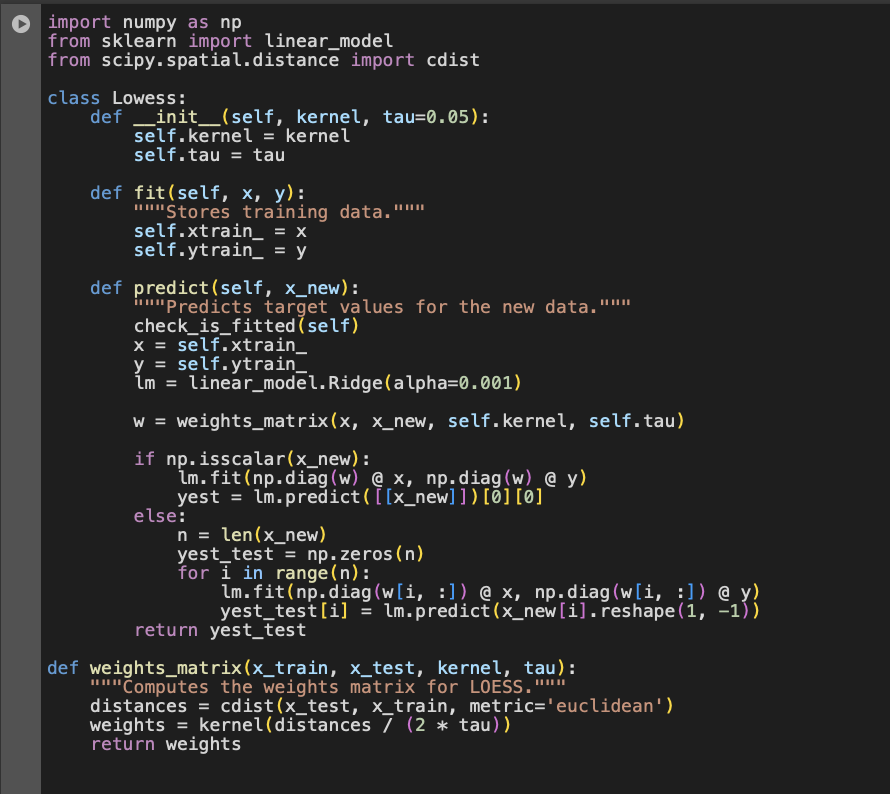

# HW1 - GitHub Page and Locally Weighted Regression Experiment
### Andrew Choi
### DATA 440 Capstone Projects

# Creating a locally weighted regression class for housing dataset report

## Importing and Downloading all Libraries:

The screenshot below is going to show all of the libraries and kernel functions that are needed for this project


There are lot of libraries here that were installed for the project. With many of the libraries installed, one important one to recognize is cdist. This is a special function that helps compute the pairwise distances between two sets of operations. In terms of locally weighted regression, this is important as it helps with the determining of weights new data point are influenced more by nearby data points than by distant ones. Then there is also k-fold. This is important for locally weighted regression as it helps with model evaluation and hyperparmeter tuning. This ultimatley ensures with the model performance to be optimal enough to where it generalizes well with respect to the data. 

## Computing the Distances between the points

The screenshot below is going to showcase the different ways the distances were computed for locally weighted regression (LWR)


The distances computed for both instances help with getting closer to the weights that are going to be used for the LWR model. To reiterate, the points closer to the query point will be valued with higher weights and simultaneously points farther away will get lower weights. 

## Utilizing cdist

The screenshot here is just showing that in LWR code cdist was computed


```
- Calculates the pairwise distances
- Uses the scaled dataset
```

## Defining the kernels used

In the screenshot below it is showing the kernels defined as well as what kernel we decide on top of the weights used for the model:


```
1. Using the Gaussian Kernel
2. Kernel function assigns weights to each point
3. The tau controls how quickly the weight decreases with increasing distance
```

The goal of this function is to help with calculating the Euclidean distances between two points and then calculating the weights based on the distances of the points. This is important and needed as it helps with the model where it fits around each of the points. 

## Establishing the model

The screenshot will show the ridge model creation.


With this model creation the code so far showcases the implementation of setting up for LWR. The purpose of the model when used is to help improve the performance of LWR by applying regularization. This helps with not only reducing the risk of overfitting to a specific data point but overall stability on the data. 

## Tackling one feature

The screenshot shows the calculations of yhat and the $r^2$ score


The calculations here of yhat and $r^2$ help with predicting the target variable based on the features of the dataset. The yhat variable represents the predicted values of the target variable. This is important as now those values can be compared with the actual values to help with LWR. The $r^2$ score helps with determing how good of a score the yhat values are. 

## Locally Weighted Regression Class Making

In the screen shots below I declared the locally weighted regression classes that are similar to the ones we discussed in class.





After utilizing the LWR class and calculating the 10-fold cross-validated mean square error, the results show a result that has the locally weight regression to have a higher MSE error value. Based on these scores, the values suggest that the Random Forst is better at predicting the target y value. The locally weighted regression class function goes to calculate the distances between the data points in order to find the weights using cidst. After processing the classes that we need we then move forward to the cross-validation. It was made sure that the x values used were standardized in order for proper analysis (as the weights may have contributed to possible noise in the project)

## The Future of the Project

This project does a great job in performing and showing off the great capabilities of using a locally residual analysis model. If I were to continue with this project I would want to continue with testing the LWR method with optimal forms to make that more efficient compared to other methods like Random Forest. While this project nonetheless showcases the important and value that can come with LWR, it was great to see how this method models the relationships of the data smooths out trends of the data as well. 


