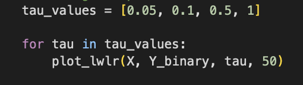

# HW1 - Gradient Boosting Class and Locally Weighted Logistic Regression
### Andrew Choi
### DATA 440 Capstone Projects

# Part 1: Creating a class that implements the Gradient Boosting concept, based on the locally weighted regression method (Lowess class), and that allows a user-prescribed number of boosting steps. 

## Defining the Libraries and Kernels

The screenshot below showcases the kernels defined for the Lowess class.

These kernels are important as they help with determining the weights given to the data points. By determining the distance between the data points and a given query point these kernel functions help figure out particular distances differently. For the Gaussian Kernel, this helps with giving weights based on the distance squared from the query point. What this means is that the points closer to the point chosen to be compared have more of an impact on the predictions made compared to farther ones. With the tricubic kernel, this kernels puts a lot more weight on cubic function of the distance between the query point and data points. This sort of means there is less of an impact on data points with increased distance. So if we need the case where we want to focus on a local neighborhood, with as little influence from farther away points, the tricubic kernel does a great job with that. Next with the quartic kernel, this calcualtes the weights based on the squared function of the distance. So using this idea, this kernel does a similar job to the other kernels, but allows for more influence on the predictions from farther away points. Finally with the Epanechnikov kernel, this provides the weights based on a piecewise linear function. This kernel gives value to the points that are within a distance of 1 and excludes all other distances that are farther away than that. Ultimately these kernel functions give flexibility in how the local data influences the predictions based on their distances. 

## Declaring the data and their x and y values

The screenshots below show the data being used and what variables are being declared.

After reading the concrete csv data file, the code declares the x and y variable. These represent the features and target variable respectively. The 'x' variable contains the whole dataset besides the strength column while the 'y' variable contains the strength column. With these declared, the model we create is setup to help predict the strength of the concrete based on all of the other features mentioned in the dataset. 

## Weight function and scaling

The screenshot above shows the code for first calculating the Euclidean distances between the points in x and the first two points in x. What this information provides is that the result is a distance matrix that shows how far the points in the dataset are compared to the first two in this case query points. Moving forward I then define the weight function. This function is used to determine the weights for the observations based on how far or close they are to the point being compared. These are important as they allow the model to be able to represent the data well and improve the predictive chances. Finally there is the line that initializes the scaler being used. This is later changed to ideally improve the model, but the scaling will help with making sure all of the features are considered equally for the distance calculations. Since some of the features may have differnent ranges, that may influence the data in such a way that may alter the predictive value of the model. 

## Defining the Lowess class

The screenshot below shows the Lowess class being used. 

The Lowess class here helps with determining the locally weighted regression method that is easily influenced by the structure of the data. After defining the constructors, the code starts with the fit function where the training data are stored into class attributes. The predict function then helps with checking if the model has been fitted correctly and then retrieves the data to be used. The function here uses the ridge regression model as it is used to stabilize the solution where some of the input features may express multicollinearlity. Moving on, the predict function adapts the input values and gives them a prediction based on their distances. 

## Running the first instance of 10-fold cross validation

The screenshots above show the code that performs the locally weighted regression and the random forest regressor with XGBoost library. After initializing the two lists to hold the mean squared error values, the scaler and k-fold cross validation is also declared. The k-fold is important as it helps with properly randomizing the distribution of data being used and then validate the models performance from the different subsets of data. The scaler is also important as it helps with regulaizing the x values so they are not all over the place. The code continues to define the model and then sets up a loop that creates the specific training and testing data sets. This is an important step as it helps with the model being able to be checked with data it has not seen yet. The code then performs some feature sclaing, and then fits the model. The code here makes the first model to be fitted by the training data as well as the predictions to be trained on the training data. The same goes with the second model and then this part helps where the second model learns from the first models and its "mistakes" in this situation. Then the code does the same for the random forest method where the MSE's are then calcualted and then compared between the two models. In this situation the decision tree is slightly better than the locally weighted regression model. 

## Another instance of the 10-fold cross validation

The screenshot here shows the change made when performing the calculation code. Here the kernel was ultimately changed from Gaussian to Quartic. Based on the MSE results you can see that although the MSE value changed, it was not by a lot. This just shows that there are many hyperparameters that can be changed and influenced here where eventually even the locally weighted regression method can perform better on the data than random forest or decision tree. In order for the best performance, techniques like grid search could have been used to determine the best MSE score and ultimately get the best model for the structured dataset. 

# Part 2: Locally weighted logistic regression on iris data

## Defining the iris dataset

The screenshot here shows the code to properly load the iris dataset into the notebook. Here we can see that once loading the dataset into a dataframe, there are four features which are the sepal length, sepal width, petal length, and the petal width. We also define a target column that declares which flower species is being described: setosa, versicolor, and virginica. 

## Assigning features and target

The screenshot here assigns the features to the x variable and the target to the y variable. To clarify, the x holds all of the columns, so the sepal length, sepal width, petal length, and petal width. The y variable here holds the species labels, which are 0, 1, or 2. In addition to defining the variables, there is also a binary target variable. This checks whether or not the target is setosa or not. This allows for the classification to work as it compares two classes in the graphs later on. 

## Locally weighted logistic regression model

The screenshots here show the code that ran the locally weighted logistic regression model. This code used parts of Calvin Chi's idea and notes on locally weighted logistic regression, but essentially this model was created to classify the iris flowers based on their petal length and petal width. In the code, the weight function helps with calculating the weights for the training data based the distance from the features. For this model, the points that were closer had higher weights and influence. The logistics function then helps with mapping the features to a range between 0 and 1. This ultimately is to help with predicting the probability that an iris flower is a setosa. So based on the values from this function, the model is able to determine how to classify certain data points. Next in the code are the training and predicting functions. What these code snippets do is that they train the model until the parameters are good enough where it is then used to generate predictions based on the training. Then there is the plotting function that helps with plotting the decision boundary plotting the points. 

## Comparing iris data plots with Calvin Chi's plots

These screenshots below show the plots of the iris data:

These screenshots below show the plots for Calvin Chi's data:

Looking at these images, there are some commonalities between the two data sets and their respective plots. With the two colored backgrounds, the red color represents the region of the features. This means that any point that is within the red background is classified as setosa. The green background on the other hand represents the region for the traget. So when the model predicts, any points in this area are versicolor or virginica. The red and green data points are both significant as they are the actual data points that are either the feature or target. While there are different boundaries created for the two datasets, it is interesting to see how the tau values plays for classification. The smaller the tau value, the more detailed the boundaries is made within the plot. So for our iris dataset, the boundary is a lot closer towards the data points. On the other hand, as the plots gradually have a higher tau value, the boundary becomes less and less significant to the point where it gets more and more general. This acknowledges the idea that it is important to find that proper tau value as it helps with forming the model's complexity and generalization. 

