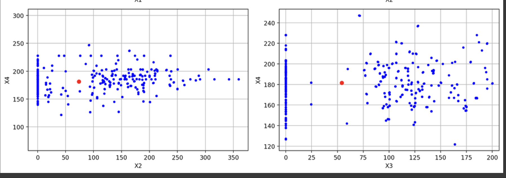

# HW3 - Regularization and Variable Selection
### Andrew Choi
### DATA 440 Capstone Projects

# Part 1: 
# Create your own PyTorch class that implements the method of SCAD regularization and variable selection (smoothly clipped absolute deviations) for linear models. Your development should be based on the following references:
- https://andrewcharlesjones.github.io/journal/scad.html
- https://www.jstor.org/stable/27640214?seq=1
# Test your method on a real data set and determine a variable selection based on features' importance, according to SCAD.

## Defining the Libraries and Kernels

The screenshots below show the classes for scaling data as well as the proper device used:

Importing the proper device here allows for the calculations for this project to be done using the CPU and sets the proper data type to be a 64-bit floating-point number. Having these statements at the beginning of the workflow allows for proper formatting of what we want to use and run the rest of the project on. Moving forward with the two scaler classes, both of these classes are designed to help fit a scaling model to the data and transform that data based on the new scaled parameters. The StandardScaler class helps with standardizing the data to have a mean of 0 and a standard deviation of 1. After this class initializes its mean and standard deviation values, it transforms the inputted data using the mean and standard deviation that was calculated. This class at the end returns a tensor of the scaled data. Next with the MinMaxScaler class, this is different from the StandardScaler in that it scales the data based on a range of 0 to 1. So after initializing the min and max values, this scaler transforms the inputted data using the calulated minimum and maximum values along with its dimensions and stores these values. Similarily, this scaling class also returns a tensor of the scaled data. These classes are important as they help with the idea of scaling where having all of the features present contribute equally to the calculations. This is quite valuable when the input data have different units or range where scaling is quite important to use. 

## Defining the regularization classes

The screenshots below show the code for the regularization classes.

The code here defines the three PyTorch classes of various types of regression models that are trying to regularize the data. The first one presented is the ElasticNet class. This class here implements a linear search where it combines both L1 (lasso) and L2 (ridge) penalties. If we were to go through the class, after initializing its constructors, there is a forward method function that performs a forward pass where it helps with predicting outputs based on input data. Next is the loss function which computes the loss by combining the MSE with L1 and L2 penalities. There is then the fit method that optimizes the model's parameters over multiple epochs using the Adam optimizer. Finally there are the predict and get coefficient methods where it helps perform the predictions and then returns the value of the weights respectively. The next class after that was defined is the Squareroot lasso class. This is a little different from ElasticNet where the SqrtLasso class only uses the L1 penalty to help with calculating penalty. So instead of combining the two regularization terms, it uses the one where it ultimately promotes feature selection by driving less important weights to zero. The final one pertains to question one where we created a SCADModel class. This class uses the idea of SCAD regularization, which aims to try and reduce the bias of L1 regularization as the SCAD here imposes a penalty that gradually reduces for larger coefficients. In this class we incorporate the scad_penalty function that calculates the SCAD regularization for the models coefficients. 

## Declaring the data and training

The screenshots here load the proper concrete dataset here as we plan to test our methods on this dataset. After loading the dataset, we prepare the target and features where the x variable represents the feature variables besides strength, while the y variable holds the strength which is the target variable. Following the declaration of the target and features, the target and features and converted to numpy arrays in the case of the next part where that is needed for training and eventually model fitting. 

## Visalizing the correlated features and determining proper variable selection

The screenshots here are showing the code and output for the visualization of the features. After changing the variables to be ready to use, the code plots the relationships for pairs of features that are important for the concrete dataset. In each of the plots, the relationship between the two features compared are presented where the mean for the two are dotted in a red circle. Once the relationships are plotted, the next code part displays a heatmap that showcases the correlations among the features. Both the plots and heatmap here are important as it helps with the idea of variable selection and ultimately seeing which variables are not as significant when doing analysis for this dataset. When looking at the plots for example, if there are two features that show a strong correlation between them, that could mean that one may not be needed since they provide similar information about concrete strength. The same is for the heatmap. Since the heatmap shows the values of the correlations between two variables, the ones that show a high correlation, we may only need one of those variables similarily. 

## Testing Penalized Regressors

The code portrays the usage of the SCAD regularization technique on the concrete dataset. From the code it produces the training losses over epochs and then ranks the importance of the features. The training losses are important as they show in the case here that the model is learning over each instance of the training. The feature ranking then shows the features that most significantly affect the target, strength, variable. What this means is that the top three features have a strong relationship with the target variable, and changes with these may largly impact the target. So based on these features and such we can see which variable we may want to use or have sit out when doing particualr analysis on the concrete dataset. 

# Part 2:
# Based on the simulation design explained in class, generate 200 data sets where the input features have a strong correlation structure (you may consider a 0.9) and apply ElasticNet, SqrtLasso and SCAD to check which method produces the best approximation of an ideal solution, such as a "betastar" you design with a sparsity pattern of your choice.

## Creating simulated data set

In the code snippets here, the purpose of this is to first simulate a a synthetic data set of X and y. Going through the code here, it defines a make_correlated_feature function where it uses the idea of Toeplix matrix which is a matrix of random normally distributed features. The code then goes to generate both the X matrix and the y, target, values by incorporating noise to act as a proper simulated dataset. 

## Evaluating three different models

The code here showcases the idea of using the dataset created to evaluate the three kinds of models that we established with their own respective classes. We are looking at each of these and seeing how well they are able to predict the target variable and recover the true sparse structure of the underlying coefficients. In order to compare and see which model produces the best possible of an ideal solution, the code evaluates each of the models after running one instance of the dataset into each of the classes. When comparing the MSE values calcualted for each, the one with the lower score is often declared to be the most appropriate for prediction accuracy for the concrete dataset. 

# Part 3:
# Use the methods you implemented above to determine a variable selection for the Concrete data set with quadratic interaction terms (polynomial features of degree 2). To solve this, you should consider choosing the best weight for the penalty function. What is the ideal model size (number of variables with non-zero weights), and what is the cross-validated mean square error?

## Declaring the quadratic interaction terms

After restating the target and feature variable, the code continues to use the PolynomialFeatures class to generate the polynomial features to the next degree per the question asked. This ultimately changes the original 8 features where the there are now the interaction terms and the squared terms of the features. 

## Plotting the pairwise relationships

The code here is doing similar actions as question 1 where we plot the features against each other and then create a heatmap that simiarily compares the features. To reiterate, the comparisons of the features are important as they help with visualizing and inspecting the distribution as well as the relationships between different polynomial feature combinations here. Based on these visuals, we are able to investigate and see which features we want to keep out in future analysis or ones that we really want to keep. We are able to visually see which features have a strong correlation with the dataset, and then the ones that do not. 

## Calculations of the new quadratic interaction

Based on the code here, it is important to take a look and evaluate the sort of outcome based on what was created with the new parameters said by the last question. The lasso regression calculated here is important as it helps with feature selection in that it takes the features that are not too significant and assigning them to the value of 0. The goal and hope of this process is to reduce the complexity of the of the model and have the model be able to work with the proper features more deeply. This always helps with preventing overfitting and focusing significant predictors. For cross-validation, this helps with determining how well the model is dealing with the new particular kind of data. Based on these values we can determine which variable and the ideal model size. 

