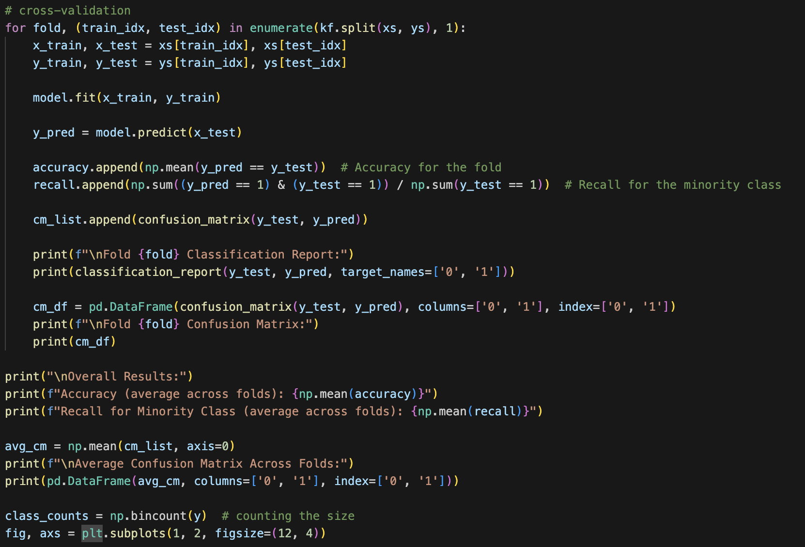

# HW4 - Classification with Class Imbalance
### Andrew Choi
### DATA 440 Capstone Projects

# Project: 
## This assignment focuses on methods of classification when data has a class imbalance. You will compare results obtained with Synthetic Minority Oversampling, ADASYN with FastKDE, and Normalizing Flows to oversample the minority class. To develop the data application, you will use https://www.kaggle.com/competitions/porto-seguro-safe-driver-prediction. This dataset is very large, and in this project, you may subset 10% of observations from each class. Your results should include confusion matrices and stratified K-fold validated estimates of accuracy and recalls. For the overall presentation format of the project, the following is a good example: https://www.kaggle.com/code/rafjaa/resampling-strategies-for-imbalanced-datasets

## Defining the Libraries and Reading the dataset used 

Looking at the screenshots above, we can get a basic understanding of the code and the data that we are working with. Looking at the Porto Seguro’s Safe Driver Prediction dataset, we can see that there are a lot of information tailed with answering the question of the probability that a driver will file an insurance claim in the future. Looking at the target column as well we can see that it has values of either 0 or 1 which refers to whether or not a claim was made. Looking at the rest of the screenshots however, it shows that the data set is highly imbalanced with there being over 500,000 instances of class 0 and about 21,000 instances of class 1. Based on these numbers alone we can definitely see that there is a high class imbalance for this dataset and we raise the issue of trying out classification methods to deal with data that have a class imbalance. 

## Preprocessing and looking at the distribution

The code snippets here show off the preprocessing that is sort of necessary when doing the classification for the imbalanced dataset. While properly cleaning the dataset is generally an important step, properly scaling is also important for classification, in this project, as the samples that are being generated for the minority class are then created properly. Overall the first screenshot shows and makes sure that the features are contributed equally and that the data is ready to be used and handled. The second screenshot shows a scatterplot that shows the distribution of two features. The reason I have this here is that this shows what the data sort of looks like. In other situations, looking at the distribution would be important, but in this case based on the graph we can see that it does not explain a lot of information. The reason this is because of how the values were selected in the data. Since a lot of the information was properly anonymized it makes sense in which the scatterplot is being shown here. Because of this, I decided to show the class size instead for each of the classification methods. This is an important graph to also look at because it showcases the action of oversampling the data where with the classification methods we hope to make the size for both the minority and majority classes to be about the same and therefore not imbalanced. 

## Synthetic Minority Oversampling

In this section I am going to talk about using synthetic minority oversampling (SMO) as the first method for classification on this imbalanced dataset. Before running the code, there are a few libraries that are worth mentioning: counter and SMOTE. Counter is a counting library that is important for the problems as it will help count the number of samples in each class. This is going to be especially used when considering if oversampling was done properly here by having the same number for each class. SMOTE is another important library to consider as it is a technique that is used to help with balancing the dataset by generating synthetic samples for the minority class. Continuing with the code, we start with initializing the SMOTE library and applying the generation for the minority class. At this point the count for the minority should be approximately equal to the number of the majority class. Moving forward we go with scaling the data to just make sure at this point that the data that was generated is not skewed in some way. Continuing, after deciding to go with a logistic regression model here, the code applies a stratified k-fold cross-validation where the data is split into 5 folds that are pretty much even. Then a cross-validation loop is done where it goes through and fits the model and prints out a CR and confusion matrix. Based on the results, we are given the precision, recall, f1-score and the support. For the value of 0.78, this tells us that the model is 78% correct when predicting class 0. Similarily, the value 0.91 tells us that the model is 91% correct when predicting class 1. The recall points are another important part to look at as the recall tells the proportion in which all of the actual positives that were classified correctly as positives. Based on this idea, we can see that for class 0 of 0.93, that means that for all of the actual class 0 samples, 93% of it were classified correctly. Similarily, that means that for class 1 of 0.74, that also means that for all of the actual class 1 samples, 74% of it were classified correctly. The F-1 score is another important feature to look at as it is a good indicator of how well the classification is for in this case the imbalanaced dataset. The F-1 score takes into account both precision and recall and so it is a good balanced indicator of how well the model is accurately classifying the data. Moving on to the confusion matrix, this shows us all of the true negatives, false positives, false negatives, and true positives that were classified correctly. After running the synthetic mintory oversampling, the 10,631 represents the number of true negatives in which the model correctly predicted class 0. The false positive and negative respectively represent the incorrectly predictions of class 1 and then class 0. Finally the 8,449 value represents the true positives in which tell us how well the model correctly predicted class 1. Looking at the second fold there is a significant increase in accuracy by the model for the predictions. Based on the code, we continue to take the average of those and plot them on a confusion matrix and so I plan on looking at that when making the comparisons based on the different methods of classification for the imbalanced dataset. The last part of the code also creates the side by side bar plots that show the class size from the original, where we took 10% of the original dataset, and the class size after the synthetic minority oversampling was done. Based on the graph we can see that the minority class now matches the majority class which correctly indicates the sucess of oversampling in this instance. 

The screenshot above shows the results of running the synthetic minority oversampling but using a KNeighborsClassifier model instead of a regression model. Based on the results we can clearly see how much better the KNeighborsClassifer did compared to the regression results with having pretty much perfect precision when classifying class 0. For the rest of the project, I plan on using only the KNeighborsClassifier in order to compare and see, based on using the sample model, how the other classification methods work and compare for this dataset. 

## ADASYN with FastKDE

The screenshots above show the code snippet that was changed in order to do ADASYN with FastKDE. A lot of the code overall is similar between these two classification techniques, but something to point out and pay attention to here is that the ADASYN library was used to perform the different oversampling method. When uisng the ADASYN library, the sampling strategy was declared which was taken from the imblearn library. With the change on the way the data will be generated for the minority class, the code continues with counting the total number of the new class sizes and based on the last screenshot and side by side bar plots we can see that the sizes are about the same after running the oversampling. When looking at the results from using the ADASYN method, we can take a look at the first folds confusion matrix. Based on the results we can see that number of true positives and true negatives are very similar to when using the synthetic minority sampling method. What we can see that is different that for the ADASYN with FastKDE method, there is a slightly larger number of false negatives that were done compared to the first method. Overall, when looking at the end overall results, we can see that this method did a very good job with classifying and additionaly did just as good of a job as the SMO method. 

## Normalizing Flows 

With this final method for the project, the screenshots above show the results of using normalizing flows to classify an imbalanced dataset. What is different to point out with this method is that you need a coded model generator that will generate the new data for the minority class to oversample here. What normalizing flows does is it uses the model to learn about the complex distributions of the minority class and then trains based on that knowledge to create ideally new proper points for the minority class. Looking at the code, I created a simple model generator that uses MaskedAffineAutoregressiveTransform and ReversePermutation to handle and look at the complex nature of the data. After training the model generator, it adds the data on top of the already existing minority class and based on the bar plots we can see that the class sizes now match after running normalizing flows method. Looking at the results we can see that for the first fold we can see that the precision for class 0 was 76%, but then 100% for class 1. Looking at the confusion matrix we can see that the false negatives is a lot larger compared to the other two methods above but overall the classification is done pretty well and balanced just like the other methods above. Based on this whole project we can see how well these three methods deal with an imbalanced dataset by oversampling. 

